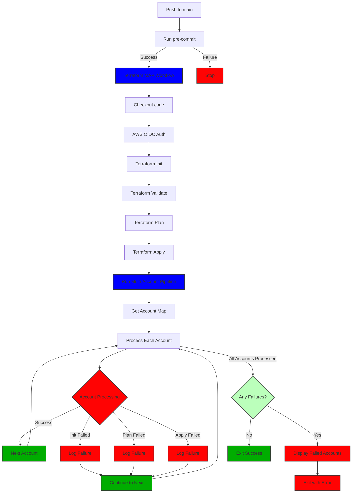

<!-- BEGIN_TF_DOCS -->
# tf-template-multi-account-pipeline

GitHub: [fortellar/tf-template-multi-account-pipeline](https://github.com/fortellar/tf-template-multi-account-pipeline)

Fortellar Multi Account Pipeline - Template

This Terraform Multi Account pipeline is designed to apply a base configuration to all non master accounts in our environment. The root AWS organization account should be provisioned independently, and this pipeline will handle the rest of the accounts.
The pipeline is triggered by a push to the main branch, and it will run pre-commit hooks before proceeding with the Terraform workflow.

## Use cases
This template is designed to be used in a multi-account AWS environment where you want to apply a base configuration across multiple accounts. It is particularly useful for organizations that follow Infrastructure as Code (IaC) practices and want to ensure consistency across their AWS accounts.

It's not intended for use in single-account environments or for applying configurations that are not suitable for multiple accounts.

## What will it configure by default?
1. OIDC authentication for GitHub Actions to assume a role in the target AWS account.
    1. OIDC Identity Provider in the target AWS account.
    1. oidc role in the target AWS account.
1. A secure IAM password policy and IAM account alias.
1. AWS Account Alternate contacts

# Configuring for your environment
To configure this template for your environment, you need to set up the following:
1. **AWS Account ID**: Replace `REPLACEME_WITH_YOUR_AWS_ACCOUNT_ID` in the GitHub workflow with your actual AWS account ID.
1. **AWS Region**: Set the AWS region in the GitHub workflow to the region where you want to deploy the resources (default is `us-west-2`).
1. By default the MAP pipeline uses the `OrganizationAccountAccessRole` role to access the accounts in your AWS Organization. If you want to use a different role, you can change this in the `multi-account-pipeline.sh` script.
1. Reconfigure the docker image in `push.yml` and `terraform-apply.yml` to use your own image. If you opt to continue using our image you can clone [fortellar/docker-terraform](https://github.com/fortellar/docker-terraform) and build your own image with the necessary tools installed. Our image is subject to change and while we will try to keep it stable, we cannot guarantee that it will always work with your pipeline.

# Diagram
Use a [Mermaid](https://mermaid.js.org/) [plugin](https://marketplace.visualstudio.com/items?itemName=bierner.markdown-mermaid) to 
visualize this in your IDE


---

## Requirements

| Name | Version |
|------|---------|
| <a name="requirement_terraform"></a> [terraform](#requirement\_terraform) | >= 1.10.0 |
| <a name="requirement_aws"></a> [aws](#requirement\_aws) | ~> 6.0 |

## Resources

| Name | Type |
|------|------|

## Inputs

| Name | Description | Type | Default | Required |
|------|-------------|------|---------|:--------:|
| <a name="input_alternate_contacts"></a> [alternate\_contacts](#input\_alternate\_contacts) | Alternate contacts for operations, billing, and security | <pre>object({<br/>    operations = object({<br/>      name          = string<br/>      title         = string<br/>      email_address = string<br/>      phone_number  = string<br/>    })<br/>    billing = object({<br/>      name          = string<br/>      title         = string<br/>      email_address = string<br/>      phone_number  = string<br/>    })<br/>    security = object({<br/>      name          = string<br/>      title         = string<br/>      email_address = string<br/>      phone_number  = string<br/>    })<br/>  })</pre> | n/a | yes |
| <a name="input_child_account_automation"></a> [child\_account\_automation](#input\_child\_account\_automation) | Enable child account automation | `bool` | `false` | no |
| <a name="input_enable_guardduty"></a> [enable\_guardduty](#input\_enable\_guardduty) | Enable GuardDuty - Will provision IAM roles | `bool` | n/a | yes |
| <a name="input_oidc_subjects"></a> [oidc\_subjects](#input\_oidc\_subjects) | oidc Additional Subjects | `list(string)` | `[]` | no |
| <a name="input_region"></a> [region](#input\_region) | AWS region to use | `string` | `"us-west-2"` | no |
| <a name="input_target_account_id"></a> [target\_account\_id](#input\_target\_account\_id) | The AWS Account ID to target. | `string` | `""` | no |
| <a name="input_target_account_name"></a> [target\_account\_name](#input\_target\_account\_name) | The AWS Account Name to target. | `string` | `""` | no |

## Outputs

| Name | Description |
|------|-------------|
| <a name="output_account_map"></a> [account\_map](#output\_account\_map) | AWS Organization account map |
| <a name="output_oidc_role"></a> [oidc\_role](#output\_oidc\_role) | OIDC Role ARN for GitHub Actions |
| <a name="output_target_account_id"></a> [target\_account\_id](#output\_target\_account\_id) | AWS Account ID to target in MAP |
| <a name="output_target_account_name"></a> [target\_account\_name](#output\_target\_account\_name) | AWS Account Name to target in MAP |

---

### Before this is applied, you need to configure the git hook on your local machine
```bash
# Test your pre-commit hooks - This will force them to run on all files
pre-commit run --all-files

# Add your pre-commit hooks forever
pre-commit install
```

Note: Before reading, uncomment the code for the environment that you
wish to apply the code to. This goes for both the init-tfvars and apply-tfvars
folders.

Note, manual changes to the README will be overwritten when the documentation is updated. To update the documentation, run `terraform-docs -c .config/.terraform-docs.yml .`
<!-- END_TF_DOCS -->